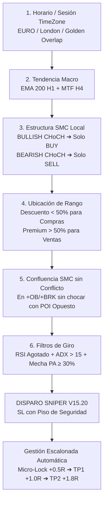

# 🦅 GUÍA OPERATIVA INSTITUCIONAL — AURUM VISION V15.20 & SNIPER MT5
> **Manual Táctico de Estrategia, Lectura de Gráfico, Indicadores y Entradas Sniper**  
> **Versión del Sistema:** V15.20 Institutional Edition (SMC Pro + Anti-CHoCH + TimeZone + Mutex Lock)  
> **Sincronización:** TradingView (`AurumVision.pine`, `TimeZone.pine`) & MetaTrader 5 (`AurumSniper.mq5`, `AurumSniperMicro.mq5`)  
> **Temporalidad Oficial:** M15 (Gráficos en 15 minutos) con confirmación Macro H1 y MTF H4  

---

## 🧭 1. Filosofía Operativa y Arquitectura del Sistema (V15.20)

El sistema **Aurum V15.20** elimina la improvisación y los errores psicológicos combinando análisis institucional de flujo de órdenes con ejecución algorítmica matemática:

1. **Smart Money Concepts (SMC Avanzado):** Seguimiento de la liquidez bancaria en lugar de soportes y resistencias tradicionales minoristas.
2. **Filtro de Alineación Estructural Anti-CHoCH (Nuevo en V15.20):** Queda estrictamente prohibido abrir ventas si la estructura local de corto plazo quebró al alza (`BULLISH CHoCH` o `BULLISH BOS`), y prohibido comprar si quebró a la baja (`BEARISH CHoCH`).
3. **Protección ante POI Opuesto (Nuevo en V15.20):** Nunca se vende directamente sobre un bloque o soporte institucional alcista activo (`+OB` o `+BRK`), ni se compra contra un bloque de oferta bajista (`-OB` o `-BRK`).
4. **Horarios TimeZone & Killzones (Nuevo en V15.20):** Integración de las ventanas de mayor liquidez:
   - **Sesión EURO ("1200-2000" UTC / 06:00 a 14:00 CDMX):** Sombreado Azul suave.
   - **Sesión London ("1230-1830" UTC / 06:30 a 12:30 CDMX):** Sombreado Rojo suave.
   - **Golden Overlap:** Confluencia máxima de volumen institucional.
5. **Mutex Inter-Gráfico Global en MT5:** Bloqueo de 15 segundos entre disparos de la misma familia de divisas (USD), erradicando las race conditions que duplicaban el riesgo en EURUSD y GBPUSD al mismo milisegundo.
6. **Gestión de Salidas con Micro-Lock (+0.5R):** Asegura Break-Even y cobra el 50% del volumen al alcanzar +0.5R, garantizando que una operación ganadora jamás termine en pérdida.



---

## 🎨 2. Cómo Leer el Gráfico Paso a Paso

Al abrir el gráfico en **M15** con [AurumVision.pine](file:///c:/Users/AurumArch/Documents/PROYECTOS/aurumcapital-mt5/AurumVision.pine), sigue este orden visual de arriba hacia abajo:

```
+----------------------------------------------------------------------------------------------------+
|  [HUD PANEL - ESQUINA SUPERIOR DERECHA]                                                            |
|  Killzone: 🔥 GOLDEN OVERLAP | Estructura: BULLISH CHoCH [Solo BUY] | Rango: DESCUENTO             |
|  Confluencia: BULL BREAKER   | RSI: 39.2 (Verde)                   | Trend H1: ALCISTA (BUY)      |
+----------------------------------------------------------------------------------------------------+
|                                                                                                    |
|  [FONDO DEL GRÁFICO]                                                                               |
|  - Franja Azul Suave = Sesión EURO (12:00 - 20:00 UTC)                                             |
|  - Franja Roja Suave = Sesión London Central (12:30 - 18:30 UTC)                                   |
|                                                                                                    |
|  [CAJAS INSTITUCIONALES SMC]                                                                       |
|  - Caja Cian (+OB)      : Piso institucional para comprar.                                         |
|  - Caja Azul (+BRK)     : Breaker alcista (antigua resistencia convertida en soporte).             |
|  - Caja Roja (-OB)      : Techo institucional para vender.                                         |
|  - Caja Púrpura (-BRK)  : Breaker bajista (antiguo soporte convertido en resistencia).             |
|                                                                                                    |
|  [LÍNEA DORADA CENTRAL (50%)]                                                                      |
|  - Arriba = Zona PREMIUM (Solo buscar ventas)                                                      |
|  - Abajo  = Zona DESCUENTO (Solo buscar compras)                                                   |
+----------------------------------------------------------------------------------------------------+
```

### 2.1. Las Franjas de Color de Fondo (TimeZone Sessions)
* **Franja Azul Suave (`EURO` 1200-2000 UTC / 06:00 a 14:00 CDMX):**
  - Señala la ventana de actividad de los mercados europeos y su interacción con Nueva York.
  - Es el momento donde el volumen comienza a entrar y se forman las estructuras direccionales limpias.
* **Franja Roja Suave (`London` 1230-1830 UTC / 06:30 a 12:30 CDMX):**
  - Señala el núcleo de máxima volatilidad y expansión del día (London Core + NY Overlap).
  - Donde ocurren las rupturas institucionales reales y los barridos de liquidez (`SWEEP`).
* **Fondo Neutro / Oscuro:**
  - Fuera de las sesiones activas (Asia / Noche). **No se deben abrir operaciones**.

---

### 2.2. El Dashboard HUD (La Brújula de Decisión)
Ubicado en la esquina superior derecha, resume la condición matemática del activo:

1. **Killzone Activa:** Confirma si estás en horario de alta probabilidad (`GOLDEN OVERLAP`, `LONDRES`, `NUEVA YORK` o `FUERA DE KILLZONE`).
2. **Estructura SMC (¡Crítico en V15.20!):**
   * Si muestra **`BULLISH CHoCH [Solo BUY]`** o **`BULLISH BOS [Solo BUY]`** en color verde: el mercado tiene sesgo comprador. **Queda prohibido abrir ventas**.
   * Si muestra **`BEARISH CHoCH [Solo SELL]`** o **`BEARISH BOS [Solo SELL]`** en color rojo: el mercado tiene sesgo vendedor. **Queda prohibido abrir compras**.
3. **Rango Institucional:**
   * `DESCUENTO (Comprar)`: El precio cotiza por debajo del 50% del rango. Válido para compras.
   * `PREMIUM (Vender)`: El precio cotiza por encima del 50%. Válido para ventas.
4. **Confluencia SMC:** Indica la zona donde se encuentra el precio (`BULLISH OB`, `BEAR BREAKER`, etc.). Si estás viendo un `BULL BREAKER`, sabes que el precio está descansando sobre un soporte comprador.
5. **RSI (M15) & ADX Fuerza:**
   * **RSI Verde (< 42):** Vendedores agotados, listo para compras.
   * **RSI Rojo (> 58):** Compradores agotados, listo para ventas.
   * **ADX:** Debe marcar `(ACTIVO)` con valor > 15–20 para garantizar que hay impulso.
6. **Trend H1 / Trend MTF H4:**
   * Dirección de la media móvil exponencial de 200 períodos.

---

### 2.3. Bloques de Órdenes (`+OB`, `-OB`) y Breakers (`+BRK`, `-BRK`)
* **`+OB` (Cian):** Última vela bajista antes de una ruptura alcista. Actúa como soporte primario.
* **`-OB` (Roja):** Última vela alcista antes de una ruptura bajista. Actúa como resistencia primaria.
* **`+BRK` (Azul):** Breaker alcista. Un `-OB` que fue roto al alza y ahora actúa como piso institucional.
* **`-BRK` (Púrpura):** Breaker bajista. Un `+OB` roto a la baja que ahora actúa como techo institucional.

---

### 2.4. Barridos de Liquidez (`x2 EQH`, `x2 EQL` y `SWEEP`)
* **`x2 EQH` / `x2 EQL`:** Techos y suelos iguales. Son piscinas de liquidez donde los traders minoristas colocan sus Stop Losses.
* **Etiqueta `SWEEP`:** Cuando una mecha perfora esa piscina y la vela cierra de vuelta adentro, las manos fuertes acaban de cazar esa liquidez. Es una de las señales de mayor probabilidad para entrar a favor del giro.

---

## 🎯 3. ¿Qué Debo Buscar Exactamente Para Entrar? (Checklist Operativo)

### Checklist Obligatorio para COMPRAS (BUY)

```markdown
[ ] 1. HORARIO: Fondo Azul (EURO) o Rojo (London), o Killzone activa en HUD.
[ ] 2. TENDENCIA MACRO: Precio > EMA 200 H1 (línea verde) y MTF H4 alcista.
[ ] 3. ESTRUCTURA SMC: HUD marca "BULLISH CHoCH [Solo BUY]" o "BULLISH BOS [Solo BUY]".
       ⚠️ Si marca BEARISH, LA COMPRA ESTÁ PROHIBIDA.
[ ] 4. UBICACIÓN: Precio por debajo de la línea dorada del 50% (Zona DESCUENTO).
[ ] 5. ZONA INSTITUCIONAL: Precio testeando un "+OB" (cian), "+BRK" (azul) o tras "SWEEP EQL".
       ⚠️ Verificar que NO esté chocando contra un "-BRK" o "-OB" opuesto activo.
[ ] 6. GATILLO DE ACCIÓN DEL PRECIO (PA):
       - Vela M15 verde de giro O mecha inferior ≥ 30% del tamaño total.
       - RSI < 42 y ADX > 15 (Activo).
➔ SEÑAL EN PANTALLA: Triángulo verde "BUY SNIPER V15".
```

---

### Checklist Obligatorio para VENTAS (SELL)

```markdown
[ ] 1. HORARIO: Fondo Azul (EURO) o Rojo (London), o Killzone activa en HUD.
[ ] 2. TENDENCIA MACRO: Precio < EMA 200 H1 (línea roja) y MTF H4 bajista.
[ ] 3. ESTRUCTURA SMC: HUD marca "BEARISH CHoCH [Solo SELL]" o "BEARISH BOS [Solo SELL]".
       ⚠️ Si marca BULLISH, LA VENTA ESTÁ PROHIBIDA (evita entrar frente al tren alcista).
[ ] 4. UBICACIÓN: Precio por encima de la línea dorada del 50% (Zona PREMIUM).
[ ] 5. ZONA INSTITUCIONAL: Precio testeando un "-OB" (rojo), "-BRK" (púrpura) o tras "SWEEP EQH".
       ⚠️ Verificar que NO esté rebotando sobre un "+BRK" o "+OB" alcista activo.
[ ] 6. GATILLO DE ACCIÓN DEL PRECIO (PA):
       - Vela M15 roja de giro O mecha superior ≥ 30% del tamaño total.
       - RSI > 58-60 y ADX > 15 (Activo).
➔ SEÑAL EN PANTALLA: Triángulo rojo "SELL SNIPER V15".
```

---

## 🛡️ 4. Cómo Gestionar las Salidas (Niveles Visuales)

Una vez confirmada la entrada, el gráfico proyecta automáticamente 5 niveles exactos:

```
[TP2: +1.8R] ══════════════════════════════════ (Línea Cian/Verde - Cierre del 40% restante)
[TP1: +1.0R] ---------------------------------- (Línea Dorada - Cierre de 50% si no hubo Micro-Lock)
[MICRO-LOCK: +0.5R] ·························· (Línea Naranja - 50% Parcial y SL a Break-Even)
[ENTRADA: 0.0R] ······························ (Línea Blanca Punteada)
[STOP LOSS: -1.0R] ════════════════════════════ (Línea Roja - Invalidación Técnica)
```

1. **Stop Loss Técnico (Línea Roja):**
   * Calculado a 2.0x ATR con pisos mínimos de seguridad:
     * **Oro (XAUUSD):** Mínimo $10.0 USD, Techo máximo $18.0 USD.
     * **EURUSD:** Mínimo 14.0 pips en M15.
     * **GBPUSD:** Mínimo 16.0 pips en M15.
     * **USDJPY:** Mínimo 15.0 pips en M15.
   * *El dimensionamiento del lote ajusta el volumen automáticamente para arriesgar exactamente tu porcentaje deseado (ej. 0.5% o 1.0%), dando holgura suficiente para no ser cazado por el ruido.*
2. **Micro-Lock a +0.5R (Línea Naranja):**
   * En cuanto el precio avanza el 50% del camino hacia 1R, el sistema liquida el 50% de la posición y mueve el SL a Break-Even (+ spread).
   * **A partir de este instante el trade es 100% libre de riesgo.**
3. **Target Principal a +1.8R (Línea Cian):**
   * Toma de beneficios del resto de la posición para capturar la expansión intradía.

---

## 🤖 5. Sincronización con MetaTrader 5 (`AurumSniper.mq5`)

Las reglas del indicador de TradingView están clonadas al 100% dentro del Expert Advisor de MetaTrader 5:

| Regla / Filtro | En TradingView (`AurumVision.pine`) | En MetaTrader 5 (`AurumSniper.mq5`) |
| :--- | :--- | :--- |
| **Alineación Anti-CHoCH** | `inp_strict_smc_align = true` | `InpStrictSMCAlign = true` |
| **Bloqueo ante POI Opuesto** | `inp_block_opposing_poi = true` | `InpBlockOpposingPOI = true` |
| **Sesiones / Killzone** | Filtro `in_killzone` (Londres/NY/EURO) | `InpUseHighLiquiditySession = true` (01:15 a 12:00 CDMX) |
| **Anti-Race Condition USD** | Manual por lectura visual | `AURUM_USD_DISPATCH_TIME` (Mutex global inter-gráfico) |
| **Piso SL en Forex** | Configurado por activo | `g_min_sl_price` adaptado a M15 (14-16 pips) |
| **Micro-Lock Temprano** | Proyección visual línea naranja | Ejecución de parcial automático y SL a BE en MT5 |

---

## 📌 6. Los 3 Errores Más Comunes Que Debes Evitar

1. **Vender en zona Premium cuando la estructura es `BULLISH CHoCH`:**
   * Aunque el precio esté "caro", si el mercado acaba de romper máximos con fuerza alcista, vender es ponerse frente a un tren. **Espera un quiebre bajista antes de buscar ventas**.
2. **Operar fuera de las Killzones (Noche / Sesión Asiática):**
   * Operar a las 8:00 PM o 10:00 PM expone tu capital a consolidaciones sin volumen y a ensanchamiento de spreads. Opera solo en la ventana activa (Londres y NY).
3. **Poner Stop Losses menores a 10–12 pips en Forex:**
   * En temporalidad M15, un Stop Loss de 7 pips suele ser barrido por la respiración normal de una vela antes de que el movimiento ocurra. Deja que el piso de seguridad de V15.20 le dé espacio al trade y deja que el cálculo de lotaje controle los dólares de riesgo.
