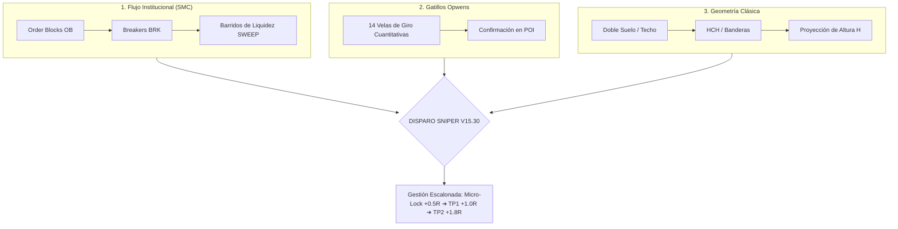

# 🦅 GUÍA OPERATIVA INSTITUCIONAL — AURUM VISION V15.35 PRO & SNIPER MT5
> **Manual Maestro de Trading: Conceptos, Elementos Visuales, Gatillos Opwens, Patrones Clásicos, Barridos de Liquidez (Sweeps) e Independencia Operativa Total.**  
> **Versión Oficial:** V15.35 Pro Institutional & Classic Edition  
> **Sincronización:** TradingView ([`AurumVision.pine`](file:///c:/Users/Administrator/Documents/PROYECTOS/aurumcapital-mt5/AurumVision.pine)) & MetaTrader 5 ([`AurumSniper.mq5`](file:///c:/Users/Administrator/Documents/PROYECTOS/aurumcapital-mt5/AurumSniper.mq5), [`AurumSniperMicro.mq5`](file:///c:/Users/Administrator/Documents/PROYECTOS/aurumcapital-mt5/AurumSniperMicro.mq5), [`AurumClassicSniper.mq5`](file:///c:/Users/Administrator/Documents/PROYECTOS/aurumcapital-mt5/AurumClassicSniper.mq5))  
> **Temporalidad Principal:** M15 (Gráficos de 15 Minutos) con confirmación Macro en H1 y MTF en H4.
> **Novedad V15.35:** Independencia absoluta de órdenes automáticas frente a manuales, gatillos prioritarios por Sweep de Liquidez y RSI adaptativo dinámico.

---

## 📖 Índice Rápido
1. [Introducción: ¿Qué es Aurum Vision V15.35 Pro?](#-1-introducción-qué-es-aurum-vision-v1535-pro)
2. [Novedades Clave V15.35: Independencia Manual y Barridos de Liquidez](#-2-novedades-clave-v1535-independencia-manual-y-barridos-de-liquidez)
3. [Diccionario Visual: Elementos, Nombres y Colores en tu Gráfico](#-3-diccionario-visual-elementos-nombres-y-colores-en-tu-gráfico)
4. [El Panel HUD: Tu Brújula de Decisión en Tiempo Real](#-4-el-panel-hud-tu-brújula-de-decisión-en-tiempo-real)
5. [Motor Cuantitativo Opwens: Los 14 Gatillos de Velas Japonesas](#-5-motor-cuantitativo-opwens-los-14-gatillos-de-velas-japonesas)
6. [Motor Cartista Clásico: Figuras Geométricas y Proyección H](#-6-motor-cartista-clásico-figuras-geométricas-y-proyección-h)
7. [Cómo Operar Paso a Paso (Tutorial para Principiantes)](#-7-cómo-operar-paso-a-paso-tutorial-para-principiantes)
8. [Checklists Operativos de Compra y Venta](#-8-checklists-operativos-de-compra-y-venta)
9. [Gestión de Riesgo y Salidas Escalonadas (Micro-Lock, TP1, TP2)](#-9-gestión-de-riesgo-y-salidas-escalonadas-micro-lock-tp1-tp2)
10. [Los 5 Errores Fatales que Debes Evitar](#-10-los-5-errores-fatales-que-debes-evitar)

---

## 🌟 1. Introducción: ¿Qué es Aurum Vision V15.35 Pro?

**Aurum Vision V15.30 Pro** es un sistema híbrido de trading institucional de alta precisión. A diferencia de los indicadores convencionales que saturan la pantalla de medias móviles o señales retrasadas, Aurum une **3 pilares matemáticos**:



1. **Smart Money Concepts (SMC):** Identifica dónde los grandes fondos institucionales y bancos inyectan órdenes y dónde cazan los *Stop Losses* del público minorista.
2. **Gatillos Candlestick Opwens:** Ratios matemáticos exactos en las velas (martillos, envolventes, pinzas) que confirman el rechazo instantáneo en la zona bancaria.
3. **Chartismo Clásico (Módulo 2 Trading Blueprint):** Figuras de reversión y continuación con medición proyectada de altura técnica ($H$).

---

## ⚡ 2. Novedades Clave V15.35: Independencia Manual y Barridos de Liquidez

La actualización **V15.35** incorpora mejoras críticas solicitadas para la operativa real:

### 1. Independencia Algorítmica Absoluta de Órdenes Manuales
- **Problema previo:** Si el trader abría una posición manual en XAUUSD (con Magic Number 0) o en divisas correlacionadas, el EA interpretaba que ya existía exposición en el símbolo o en la cesta USD y **bloqueaba la apertura de trades automáticos**.
- **Solución V15.35:** Las comprobaciones de posiciones abiertas (`IsPositionOpenOnSymbol()` y `HasUnprotectedCorrelatedUSDPosition()`) ahora filtran **exclusivamente por `magic == MAGIC_NUMBER`**.
- **Resultado:** Puedes colocar trades discrecionales a mano sin que el bot se desactive ni pierda sus entradas sniper automáticas.

### 2. Barridos de Liquidez (Sweeps) como POI de Primer Orden
- Cuando ocurre un barrido de liquidez (*Liquidity Sweep*) de mínimos (`EQL`) o máximos (`EQH`), el sistema ya no exige que el precio se encuentre dentro de un Order Block previo para autorizar la entrada.
- El propio barrido con rechazo se valida como un Punto de Interés (POI) institucional inmediato.

### 3. RSI Adaptativo Dinámico en Absorciones Rápidas
- En rebotes violentos tras un barrido, el precio suele dispararse rápidamente antes de que el RSI caiga por debajo de 38.0.
- V15.35 amplía dinámicamente el umbral a **RSI < 48.0 en compras** y **RSI > 52.0 en ventas** cuando hay un sweep activo, permitiendo capturar el rebote sin esperar sobreventa artificial.

### 4. Gatillo de Absorción en 1 Barra
- Se autoriza la entrada en el cierre de una sola vela de rechazo violento (*pinbar* o martillo con mecha $\ge 30-60\%$), garantizando el mejor precio de entrada.

### 5. Modo 24h para Metales
- El filtro horario se flexibiliza para Oro (XAUUSD) y Plata (XAGUSD), reconociendo el flujo continuo de liquidez interbancaria global.

---

## 🎨 3. Diccionario Visual: Elementos, Nombres y Colores en tu Gráfico

Cuando instalas [`AurumVision.pine`](file:///c:/Users/Administrator/Documents/PROYECTOS/aurumcapital-mt5/AurumVision.pine) en TradingView, verás un gráfico limpio e interactivo. A continuación tienes la definición exacta de cada elemento:

```
+---------------------------------------------------------------------------------------------------+
|  [HUD PANEL - ESQUINA SUPERIOR DERECHA]                                                           |
|  Killzone: 🔥 GOLDEN OVERLAP | Estructura: BULLISH CHoCH [Solo BUY] | Rango: DESCUENTO            |
|  Confluencia: BULL BREAKER   | Gatillo: ENGULFING ALCISTA          | Patrón: DOBLE SUELO (W)     |
+---------------------------------------------------------------------------------------------------+
|                                                                                                   |
|  [FONDO DEL GRÁFICO - SESIONES TIMEZONE]                                                          |
|  - Fondo Azul Suave : Sesión EURO (12:00 a 20:00 UTC)                                             |
|  - Fondo Rojo Suave : Sesión London Core (12:30 a 18:30 UTC)                                      |
|                                                                                                   |
|  [ZONAS INSTITUCIONALES SMC]                                                                      |
|  - Caja Cian (+OB)     : Order Block Alcista (Piso de compras institucionales).                   |
|  - Caja Azul (+BRK)    : Bullish Breaker (Antiguo techo perforado convertido en piso).            |
|  - Caja Roja (-OB)     : Order Block Bajista (Techo de ventas institucionales).                    |
|  - Caja Púrpura (-BRK) : Bearish Breaker (Antiguo piso perforado convertido en techo).            |
|  - Franja Verde (+FVG) : Fair Value Gap Alcista (Desequilibrio comprador / Imán de precio).       |
|  - Franja Roja (-FVG)  : Fair Value Gap Bajista (Desequilibrio vendedor / Imán de precio).        |
|                                                                                                   |
|  [PISCINAS DE LIQUIDEZ Y BARRIDOS]                                                                |
|  - "x2 EQH" / "x2 EQL" : Techos/Suelos Iguales donde hay acumulación masiva de Stop Losses.      |
|  - Etiqueta "SWEEP"    : Las manos fuertes perforaron la zona y cerraron de vuelta (Caza de Stops)|
|                                                                                                   |
|  [LÍNEA DORADA CENTRAL (50% EQUILIBRIO)]                                                          |
|  - Por encima: Zona PREMIUM (El precio está CARO ➔ Solo buscar ventas).                          |
|  - Por debajo: Zona DESCUENTO (El precio está BARATO ➔ Solo buscar compras).                      |
|                                                                                                   |
|  [GATILLOS OPWENS & PATRONES CLÁSICOS]                                                            |
|  - Diamante Verde "OPW-B" : Vela de confirmación alcista Opwens (Martillo, Envolvente, etc.).     |
|  - Diamante Rojo  "OPW-S" : Vela de confirmación bajista Opwens (Estrella Fugaz, etc.).           |
|  - Línea Dorada Punteada  : 🎯 PROYECCIÓN H (Objetivo técnico medido del patrón clásico).         |
+---------------------------------------------------------------------------------------------------+
```

---

## 🧭 3. El Panel HUD: Tu Brújula de Decisión en Tiempo Real

El **Dashboard HUD** (ubicado en la esquina superior derecha) sintetiza más de 100 cálculos algorítmicos en un semáforo visual directo:

| Fila en HUD | Nombre | ¿Qué Significa? | Regla Operativa para el Trader |
| :--- | :--- | :--- | :--- |
| **0** | **Título** | `🦅 AURUM VISION V15.30 PRO` | Versión institucional activa. |
| **1** | **Killzone Activa** | `🔥 GOLDEN OVERLAP`, `LONDRES`, `NY` o `FUERA` | **Solo operar si está en color Dorado, Cian o Púrpura.** Fuera de sesión (Gris), el spread sube y no hay volumen. |
| **2** | **Estructura SMC** | `BULLISH CHoCH / BOS [Solo BUY]` o `BEARISH [Solo SELL]` | **¡Filtro Supremo Anti-Pérdidas!** Si marca Verde, **prohibido vender**. Si marca Rojo, **prohibido comprar**. |
| **3** | **Rango Institucional** | `DESCUENTO (Comprar)` o `PREMIUM (Vender)` | Compra barato (Descuento) y vende caro (Premium). Nunca compres en Premium. |
| **4** | **Confluencia SMC** | `BULLISH OB`, `BEAR BREAKER`, etc. | Te indica sobre qué soporte o resistencia bancaria está descansando el precio. |
| **5** | **Gatillo Opwens** | `✅ ENGULFING ALCISTA`, `MARTILLO`, etc. | Muestra el patrón de velas exacto que acaba de cerrar confirmando la entrada. |
| **6** | **Patrón Clásico (H)** | `🎯 DOBLE SUELO (W)`, `BANDERA`, etc. | Indica si hay una figura chartista activa con objetivo de altura $H$. |
| **7** | **RSI (M15)** | Valor numérico (Verde < 42, Rojo > 58) | Mide el agotamiento del precio. Verde = listo para comprar; Rojo = listo para vender. |
| **8** | **Trend H1 (EMA 200)** | `ALCISTA (BUY)` o `BAJISTA (SELL)` | La tendencia macro horaria que domina la sesión. |
| **9** | **Trend MTF (H4)** | `ALCISTA (✅)` o `BAJISTA (✅)` | Filtro de temporalidad superior para no operar contra la tendencia mayor. |
| **10** | **Acción Precio (PA)** | `✅ RECHAZO CONFIRMADO` | Confirma que la vela actual o previa tuvo mecha de rechazo $\ge 30\%$ o gatillo Opwens. |
| **11** | **ADX Fuerza** | `ACTIVO (>15)` o `DORMIDO (<15)` | Si está "Dormido", el mercado está en rango muerto; no entres. |
| **12** | **Fases de Salida** | `+1.0R (50%) ➔ +1.8R (40%)` | Resumen de los objetivos de toma de ganancias. |
| **13** | **Gestión de SL** | `$10-$18 USD` (Oro) o `2.0x ATR` (Forex) | El colchón técnico calculado para que el ruido no te saque. |

---

## 🕯️ 4. Motor Cuantitativo Opwens: Los 14 Gatillos de Velas Japonesas

Basado en el manual cuantitativo de trading del **Libro Opwens A4**, el sistema evalúa matemáticamente en cada cierre de vela las proporciones de mechas y cuerpos:

### Gatillos Alcistas de Compra (`OPW-B`):
1. **Martillo (Hammer):** Cuerpo pequeño en la parte superior y mecha inferior $\ge 60\%$ del rango total. Indica absorción violenta de ventas.
2. **Martillo Invertido (Inverted Hammer):** Mecha superior $\ge 60\%$ tras caída en soporte que demuestra testeo de compradores.
3. **Envolvente Alcista (Bullish Engulfing):** Cuerpo verde que envuelve al 100% el cuerpo de la vela bajista previa con volumen expansivo.
4. **Pauta Penetrante (Piercing Line):** Abre con hueco a la baja pero cierra por encima del 50% del cuerpo de la vela bajista anterior.
5. **Estrella de la Mañana (Morning Star):** Patrón de 3 velas (vela bajista grande + doji/cuerpo diminuto + vela alcista fuerte que penetra $>50\%$).
6. **Pinzas de Suelo (Tweezers Bottom):** Dos velas consecutivas cuyos mínimos coinciden con una precisión $\le 8\%$, rebotando en el mismo milímetro del soporte bancario.
7. **Tres Soldados Blancos (Three White Soldiers):** Tres velas alcistas continuas con máximos y mínimos crecientes.
8. **Tres Velas Interiores Alcistas (Three Inside Up):** Harami alcista confirmado por una tercera vela de rotura al alza.

### Gatillos Bajistas de Venta (`OPW-S`):
1. **Hombre Colgado (Hanging Man):** Mecha inferior larga tras rally en techo de resistencia; alerta de agotamiento comprador.
2. **Estrella Fugaz (Shooting Star):** Mecha superior $\ge 60\%$ del tamaño total rechazando una zona de oferta.
3. **Envolvente Bajista (Bearish Engulfing):** Cuerpo rojo que traga completamente a la vela alcista precedente.
4. **Cubierta de Nube Oscura (Dark Cloud Cover):** Abre con hueco arriba pero cierra perforando hacia abajo el 50% de la vela alcista anterior.
5. **Estrella de la Noche (Evening Star):** Patrón de 3 velas que culmina con una fuerte caída que penetra $>50\%$ de la primera vela.
6. **Pinzas de Techo (Tweezers Top):** Dos velas con máximos idénticos rechazando el mismo techo institucional.
7. **Tres Cuervos Negros (Three Black Crows):** Tres velas bajistas consecutivas con fuerte volumen vendedor.
8. **Tres Velas Interiores Bajistas (Three Inside Down):** Harami bajista confirmado por ruptura bajista de la tercera barra.

> **💡 ¿Cómo se usa?**  
> Cuando el precio llega a una caja institucional (ejemplo: un `+OB` cian), **no compres a ciegas**. Espera a que aparezca el diamante verde `OPW-B` en esa vela. Eso confirma que los bancos acaban de entrar al mercado.

---

## 📐 5. Motor Cartista Clásico: Figuras Geométricas y Proyección H

Proveniente del **Módulo 2 (Forex Trading Blueprint)**, Aurum Vision escanea fractales de Dow para detectar figuras chartistas de alta probabilidad:

### 1. Figuras de Cambio de Tendencia (Reversión):
* **Doble Suelo (W) & Doble Techo (M):**  
  Dos valles o dos crestas a la misma altura. La rotura de la línea de cuello (*neckline*) dispara la proyección.
* **Hombro-Cabeza-Hombro (HCH) e HCH Invertido:**  
  La cabeza sobrepasa a los hombros; la rotura de la línea clavicular confirma el cambio de ciclo de mercado.

### 2. Figuras de Continuación de Tendencia:
* **Banderas y Banderines (Flags & Pennants):**  
  Tras un impulso vertical veloz (el *mástil*), el precio consolida en un canal estrecho en contra de la tendencia antes de reanudar la carrera con violencia.

### 3. La Proyección de Altura Técnica ($H$):
Cuando se confirma la rotura del patrón, el indicador traza en el gráfico la **Línea Dorada Punteada (`🎯 PROYECCIÓN H`)**:
$$\text{Take Profit } H = \text{Línea de Cuello} \pm \text{Altura } H \text{ de la Figura}$$
$$\text{Stop Loss Estructural} = \text{Mínimo o Máximo del patrón (Invalidación)}$$

---

## 🚀 6. Cómo Operar Paso a Paso (Tutorial para Principiantes)

Si eres nuevo operando con Aurum Vision, sigue esta rutina de 5 pasos para no cometer ningún error:

### Paso 1: Revisa el Reloj (Sesión Activa)
* Abre tu gráfico en **M15**.
* Comprueba que el fondo tenga color **Azul** (Sesión EURO) o **Rojo** (Sesión London), o que el HUD indique `GOLDEN OVERLAP` o `LONDRES`.
* *Si el fondo está oscuro y el HUD dice `FUERA DE KILLZONE`: cierra el gráfico y no operes.*

### Paso 2: Consulta el HUD (Dirección Permitida)
* Mira la fila **Estructura SMC**:
  * Si dice **`BULLISH CHoCH [Solo BUY]`**: Tu mente debe buscar **únicamente compras**. Tacha cualquier idea de vender.
  * Si dice **`BEARISH CHoCH [Solo SELL]`**: Tu mente debe buscar **únicamente ventas**.

### Paso 3: Ubicación de Rango (Precio Barato o Caro)
* Localiza la **Línea Dorada del 50%**:
  * Para comprar: El precio debe estar **por debajo** (Zona DESCUENTO).
  * Para vender: El precio debe estar **por encima** (Zona PREMIUM).

### Paso 4: Espera el Toque de Zona Institucional + Gatillo Opwens
* El precio entra en una caja cian (`+OB`) o azul (`+BRK`).
* Se forma una vela con diamante verde **`OPW-B`** (o aparece el triángulo verde **`BUY SNIPER V15.30`**).
* El RSI está en verde ($<42$) y el ADX marca `ACTIVO`.

### Paso 5: Coloca tu Orden con Niveles Exactos
En cuanto aparece la señal, el indicador dibuja automáticamente el setup completo con líneas horizontales:

```
[TP2: +1.8R] ══════════════════════════════════ (Línea Verde - Cierre total o Runner)
[TP1: +1.0R] ---------------------------------- (Línea Dorada - Cobro de Parcial)
[MICRO-LOCK: +0.5R] ·························· (Línea Naranja - Mover SL a Break-Even)
[PRECIO DE ENTRADA] ·························· (Línea Blanca Punteada)
[STOP LOSS: 1.0R] ════════════════════════════ (Línea Roja - Nivel de Protección)
```

1. **Entrada:** Al precio de cierre de la vela señal.
2. **Stop Loss:** En la línea roja proyectada.
3. **Take Profit 1:** En la línea dorada (+1.0R) o en la **Proyección H** si hay patrón clásico.
4. **Take Profit 2:** En la línea verde (+1.8R).

---

## ✅ 7. Checklists Operativos de Compra y Venta

Imprime o mantén abierto este checklist antes de presionar el botón de compra o venta:

### 🟢 Checklist para COMPRAS (BUY)
- [ ] **1. Horario:** Fondo Azul (EURO) o Rojo (London) activo en gráfico.
- [ ] **2. Tendencia Macro:** Precio por encima de la EMA 200 H1 (Línea Verde).
- [ ] **3. Estructura SMC:** HUD marca `BULLISH CHoCH [Solo BUY]` o `BULLISH BOS [Solo BUY]`.
- [ ] **4. Ubicación:** Precio en zona **DESCUENTO** (por debajo de la línea dorada del 50%).
- [ ] **5. Soporte Institucional:** El precio toca una caja `+OB` (Cian), `+BRK` (Azul) o tras un `SWEEP EQL`.
- [ ] **6. POI Opuesto Despejado:** No hay ninguna caja roja (`-OB`) ni púrpura (`-BRK`) inmediatamente enfrente bloqueando la subida.
- [ ] **7. Gatillo:** Aparece señal `BUY-V15` o diamante verde `OPW-B` (Martillo, Envolvente o Pinzas).
- [ ] **8. Indicadores:** RSI $< 42$ y ADX $> 15$ (Activo).

---

### 🔴 Checklist para VENTAS (SELL)
- [ ] **1. Horario:** Fondo Azul (EURO) o Rojo (London) activo en gráfico.
- [ ] **2. Tendencia Macro:** Precio por debajo de la EMA 200 H1 (Línea Roja).
- [ ] **3. Estructura SMC:** HUD marca `BEARISH CHoCH [Solo SELL]` o `BEARISH BOS [Solo SELL]`.
- [ ] **4. Ubicación:** Precio en zona **PREMIUM** (por encima de la línea dorada del 50%).
- [ ] **5. Resistencia Institucional:** El precio toca una caja `-OB` (Roja), `-BRK` (Púrpura) o tras un `SWEEP EQH`.
- [ ] **6. POI Opuesto Despejado:** No hay ninguna caja cian (`+OB`) ni azul (`+BRK`) inmediatamente debajo frenando la caída.
- [ ] **7. Gatillo:** Aparece señal `SELL-V15` o diamante rojo `OPW-S` (Estrella Fugaz, Envolvente o Pinzas).
- [ ] **8. Indicadores:** RSI $> 58$ y ADX $> 15$ (Activo).

---

## 🛡️ 8. Gestión de Riesgo y Salidas Escalonadas (Micro-Lock, TP1, TP2)

El sistema Aurum está diseñado bajo la premisa de que **proteger el capital es más importante que ganar dinero rápido**:

1. **Riesgo Fijo por Operación (Regla del 1%):**
   * Nunca arriesgues más del **0.5% al 1.0%** de tu balance total en una sola operación.
   * El indicador calcula la distancia de Stop Loss en pips/dólares; ajusta tu lotaje para que esa distancia represente exactamente tu 1%.

2. **Micro-Lock a +0.5R (Línea Naranja):**
   * Cuando el trade avanza la mitad del camino hacia el TP1 (+0.5R), se cobra el **50% de la ganancia** y se mueve el **Stop Loss al precio de entrada (Break-Even + spread)**.
   * *A partir de este momento, el trade tiene 0.00% de riesgo de pérdida.*

3. **Take Profit 1 a +1.0R (Línea Dorada):**
   * Retiro de ganancia parcial para asegurar el beneficio de la sesión.

4. **Take Profit 2 a +1.8R o Proyección H (Línea Verde):**
   * Cierre final de la posición para capturar la expansión completa del día.

---

## ⚠️ 9. Los 5 Errores Fatales que Debes Evitar

1. **Vender cuando la estructura marca `BULLISH CHoCH`:**
   * Aunque el precio parezca estar "demasiado alto", si los bancos quebraron la estructura al alza, vender es pararse frente a un tren de carga. Respeta siempre el texto del HUD.
2. **Operar en horario de Asia / Noche:**
   * Entre las 18:00 y las 02:00 (hora local), los spreads de los brokers se ensanchan y el mercado se mueve en rangos erráticos. Opera únicamente en sesiones con liquidez.
3. **Apretar el Stop Loss manualmente:**
   * No pongas el Stop Loss a 4 o 5 pips de la entrada por miedo. El mercado necesita espacio para fluctuar (respeta los pisos de 14-16 pips en Forex o $10 en Oro que calcula el sistema).
4. **Comprar en Zona Premium o Vender en Descuento:**
   * En los negocios se compra al por mayor (barato) y se vende al por menor (caro). En trading es igual: nunca compres por encima del 50% del rango.
5. **Sobreoperar tras una pérdida:**
   * Si una operación toca el Stop Loss, no te apresures a entrar de inmediato en sentido contrario. Respeta la disciplina y espera a que el checklist vuelva a dar luz verde completa.
