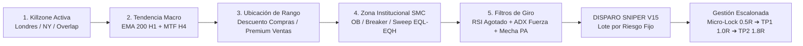

# 🦅 GUÍA OPERATIVA INSTITUCIONAL — AURUM VISION V15 & SNIPER MT5
> **Manual Táctico de Estrategia, Indicadores, Entradas y Salidas**  
> **Versión del Sistema:** V15.0 Institutional Edition (SMC Pro + Orderblocks & Breakers)  
> **Sincronización:** TradingView (`AurumVision.pine`) & MetaTrader 5 (`AurumSniper.mq5` / `AurumSniperMicro.mq5`)  
> **Temporalidad Oficial:** M15 (Gráficos en 15 minutos) con confirmación Macro H1 y MTF H4  

---

## 🧭 1. Filosofía Operativa y Arquitectura del Sistema

El sistema **Aurum V15** fue diseñado para eliminar la subjetividad del trading manual y proteger el capital mediante la combinación de:
1. **Smart Money Concepts (SMC de `SMC.txt`):** No adivinar soportes y resistencias minoristas, sino seguir la huella de los grandes bancos e instituciones donde se acumula la liquidez real.
2. **Orderblocks y Breakers con Inversión de Polaridad (`OB.txt`):** Identificar la última vela de compra/venta institucional previa a una ruptura y detectar cuándo un bloque quebrado se convierte en una barrera opuesta.
3. **Filtro Macro y de Ubicación de Rango:** Comprar únicamente en **Descuento (< 50% del rango)** a favor de la tendencia H1/H4 y vender únicamente en **Premium (> 50% del rango)**.
4. **Gestión de Salidas Escalonada con Micro-Lock (+0.5R):** Asegurar el trade al 50% de recorrido hacia 1R, garantizando que una operación ganadora nunca termine en pérdida.



---

## 🎨 2. Cómo Leer los Indicadores y Componentes Visuales en el Gráfico

Al abrir el gráfico en **M15** con [AurumVision.pine](file:///c:/Users/AurumArch/Documents/PROYECTOS/aurumcapital-mt5/AurumVision.pine), verás los siguientes elementos institucionales:

### 2.1. Bloques de Órdenes (Order Blocks)
* **`+OB` (Caja Cian / Azul Claro):**
  - **Qué es:** Bullish Order Block. Es la última vela bajista institucional previa al impulso que rompió un máximo previo.
  - **Cómo usarlo:** Es un **imán y piso de alta probabilidad para compras**. Cuando el precio retrocede hacia la caja `+OB`, buscamos gatillos de compra.
* **`-OB` (Caja Roja):**
  - **Qué es:** Bearish Order Block. Es la última vela alcista institucional previa a la caída que rompió un mínimo previo.
  - **Cómo usarlo:** Es un **techo de alta probabilidad para ventas**. Cuando el precio sube a testear la caja `-OB`, buscamos gatillos de venta.

---

### 2.2. Breaker Blocks (Inversión de Polaridad) & Chop Control
* **`+BRK` (Caja Azul / Soporte Invertido):**
  - **Qué es:** Un Bearish Order Block previo que fue perforado con fuerza hacia arriba. Al ser superado, el techo se convierte en un nuevo **soporte institucional** (inversión de polaridad).
  - **Cómo usarlo:** Esperamos un retesteo por encima para sumarnos en compra.
* **`-BRK` (Caja Púrpura / Resistencia Invertida):**
  - **Qué es:** Un Bullish Order Block previo que fue perforado hacia abajo. El suelo roto se transforma en una nueva **resistencia institucional**.
  - **Cómo usarlo:** Esperamos un retroceso alcista hacia la caja `-BRK` para disparar ventas.
* **Chop Control (Motor de Limpieza):**
  - Si el mercado entra en consolidación sucia y atraviesa repetidamente un Breaker, el algoritmo **lo borra automáticamente** para que tu gráfico nunca tenga cajas obsoletas o trampas laterales.

---

### 2.3. Ruptura de Estructura: BOS vs CHoCH
* **Línea continua con etiqueta `BOS` (Break of Structure):**
  - **Significado:** Ruptura a favor de la tendencia existente. Indica **continuación de tendencia**. El precio continúa marcando máximos más altos o mínimos más bajos.
  - **Acción:** No perseguir el precio inmediatamente; esperar el retroceso hacia un `+OB` o `-OB`.
* **Línea discontinua con etiqueta `CHoCH` (Change of Character):**
  - **Significado:** Primera señal de **cambio o giro de tendencia**. El precio quiebra el último swing estructural contrario.
  - **Acción:** Máxima alerta. El ciclo previo terminó; prepárate para buscar la nueva dirección del flujo institucional.

---

### 2.4. Piscinas de Liquidez (`x2 EQH` / `x2 EQL`) y Barridos (`SWEEP`)
* **Líneas punteadas `x2 EQH` (Equal Highs) / `x2 EQL` (Equal Lows):**
  - **Qué son:** Dos máximos o mínimos en el mismo nivel de precio (dobles techos o dobles suelos).
  - **La trampa minorista:** El retail cree que son "soportes y resistencias impenetrables". Para las instituciones, **son piscinas de liquidez llenas de Stop Losses listos para ser cazados**.
* **Etiquetas `🪤 SWEEP EQL` y `🪤 SWEEP EQH`:**
  - **Qué son:** Aparecen cuando el precio perfora la piscina de liquidez con una mecha y cierra de regreso adentro (caza de stops ejecutada).
  - **Acción:** Disparo de alta probabilidad en contra del barrido: compra tras `SWEEP EQL` o venta tras `SWEEP EQH`.

---

### 2.5. Fair Value Gaps (`+FVG` / `-FVG`)
* **Cajas rotuladas `+FVG` (verde) y `-FVG` (rojo tenue):**
  - Desequilibrios de 3 velas. Actúan como zonas de vacío que el precio suele rellenar antes de reanudar el impulso principal. Cuando el precio las cubre, se recortan y eliminan automáticamente.

---

### 2.6. Zonas de Rango: Premium vs Descuento (Línea de Equilibrio 50%)
* **Línea dorada central (50% Range):**
  - Divide el rango del precio en dos hemisferios.
  - **Zona Descuento (< 50%):** El precio está barato. **SOLO SE PERMITEN COMPRAS**.
  - **Zona Premium (> 50%):** El precio está caro. **SOLO SE PERMITEN VENTAS**.

---

### 2.7. Filtros de Tendencia Macro: EMA 200 H1 y MTF H4
* **Línea EMA 200 H1 en el gráfico:**
  - **Verde brillante:** Precio por encima de la EMA 200 H1 ➔ Solo compras autorizadas.
  - **Roja:** Precio por debajo de la EMA 200 H1 ➔ Solo ventas autorizadas.
* **Filtro MTF H4:** Verifica en segundo plano que la temporalidad de 4 horas no esté en sentido opuesto.

---

### 2.8. Horarios y Sombreado de Killzones (Horario UTC / CDMX)
El fondo del gráfico cambia de tonalidad según la sesión institucional:

| Killzone | Horario UTC | Horario CDMX | Fondo Gráfico | Características |
| :--- | :---: | :---: | :---: | :--- |
| 🇬🇧 **Londres Killzone** | 07:00 – 12:00 UTC | 01:00 – 06:00 CDMX | Púrpura suave | Creación del rango del día y rompimientos iniciales. |
| 🔥 **Golden Overlap** | 12:00 – 16:00 UTC | 06:00 – 10:00 CDMX | Dorado brillante | **El mejor horario**. Confluencia de volumen de Londres + Nueva York. |
| 🇺🇸 **Nueva York Killzone** | 12:00 – 21:00 UTC | 06:00 – 15:00 CDMX | Cian suave | Continuaciones fuertes e impulsos con noticias de EE.UU. |
| 🛑 **Asia / Rollover** | 21:00 – 07:00 UTC | 15:00 – 01:00 CDMX | Rojo tenue | **ZONA PROHIBIDA**. Spreads altos, baja liquidez, swaps costosos. |

---

### 2.9. El Dashboard HUD en Tiempo Real (Top Right)
El panel superior derecho monitorea el estado del mercado vela a vela:
1. **Killzone Activa:** Confirma si estás en horario operativo (`LONDRES`, `GOLDEN OVERLAP` o `FUERA DE KILLZONE`).
2. **Estructura SMC:** Indica la estructura actual (`BULLISH BOS`, `BEARISH CHoCH`, etc.).
3. **Rango Institucional:** Confirma si el precio está en `DESCUENTO (Comprar)` o `PREMIUM (Vender)`.
4. **Confluencia SMC:** Muestra si el precio está testeando un `BULLISH OB`, `BEAR BREAKER`, o si está `SIN ZONA ACTIVA`.
5. **RSI (M15):** Lectura del oscilador con código de color (verde = sobrevendido listo para compra; rojo = sobrecomprado listo para venta).
6. **Trend H1 / Trend MTF (H4):** Validación de la dirección macro institucional.
7. **Acción Precio (PA):** Informa si la última vela tiene mecha de rechazo (`RECHAZO CONFIRMADO`).
8. **ADX Fuerza:** Indica si el mercado tiene volatilidad operativa (`ACTIVO > 15`) o está plano (`DORMIDO`).

---

## 🎯 3. Protocolo Paso a Paso para Buscar ENTRADAS

Para abrir una posición (manualmente o verificar por qué el EA entró), **deben cumplirse obligatoriamente los 6 pasos del checklist institucional**:

### Checklist para Operaciones de COMPRA (BUY)
1. **[ ] Horario:** Fondo de pantalla dentro de **Londres**, **Golden Overlap** o **Nueva York** (nunca en Asia o noche CDMX).
2. **[ ] Tendencia Macro:** Precio por encima de la **EMA 200 H1** (línea verde) y filtro MTF H4 alcista o neutral.
3. **[ ] Rango de Precio:** Precio por debajo de la línea del 50% dorada (**Zona de Descuento**).
4. **[ ] Confluencia SMC:** El precio debe estar rebotando en un **`+OB` (caja cian)**, en un **`+BRK` (caja azul)** o tras haber producido un **`🪤 SWEEP EQL`**.
5. **[ ] Osciladores:** **RSI < 42** (o 40 en Oro), mostrando que el retroceso bajista se agotó; y **ADX > 15-20**.
6. **[ ] Acción del Precio (PA):** La vela cerrada debe ser verde alcista o tener una mecha inferior $\ge 30\%$ del rango total (absorción de vendedores).
➔ **Gatillo:** Aparece el triángulo verde **`BUY SNIPER V15`** en el gráfico.

---

### Checklist para Operaciones de VENTA (SELL)
1. **[ ] Horario:** Dentro de las Killzones oficiales de Londres / Nueva York.
2. **[ ] Tendencia Macro:** Precio por debajo de la **EMA 200 H1** (línea roja) y filtro MTF H4 bajista.
3. **[ ] Rango de Precio:** Precio por encima de la línea del 50% dorada (**Zona Premium**).
4. **[ ] Confluencia SMC:** El precio debe estar rechazando un **`-OB` (caja roja)**, un **`-BRK` (caja púrpura)** o tras un **`🪤 SWEEP EQH`**.
5. **[ ] Osciladores:** **RSI > 58-60**, confirmando sobrecompra; y **ADX > 15-20**.
6. **[ ] Acción del Precio (PA):** Vela cerrada roja bajista o con mecha superior $\ge 30\%$ (absorción de compradores).
➔ **Gatillo:** Aparece el triángulo rojo **`SELL SNIPER V15`** en el gráfico.

---

## 🛡️ 4. Protocolo de Gestión de SALIDAS (Riesgo y Salidas Escalonadas)

Cuando se dispara un setup, el script dibuja automáticamente las líneas de gestión con sus precios exactos:

```
[TP2: +1.8R] ══════════════════════════════════ (Línea Cian/Verde - 40% Cierre)
[TP1: +1.0R] ---------------------------------- (Línea Dorada - 50% Cierre & BE)
[MICRO-LOCK: +0.5R] ·························· (Línea Naranja - 50% Parcial & BE Lock)
[ENTRADA: 0.0R] ······························ (Línea Blanca)
[STOP LOSS: -1.0R] ════════════════════════════ (Línea Roja Fija)
```

### 4.1. El Stop Loss Inicial (SL = 1R)
* **Distancia dinámica:** Calculado automáticamente a **2.0x ATR** de la temporalidad M15.
* **Regla estricta para Oro (XAUUSD):**
  - **Piso mínimo:** $10.0 USD de distancia (evita ser sacado por el spread o mechas menores).
  - **Techo máximo:** $18.0 USD de distancia (evita arriesgar demasiado en velas monstruosas).
  - **Filtro Anti-Noticias:** Si el ATR supera $15.0 USD en Oro, el sistema bloquea nuevas entradas por volatilidad extrema.

---

### 4.2. El Micro-Lock Temprano (+0.5R) — *Blindaje de Capital*
* **Cuándo se activa:** En cuanto el precio alcanza la mitad del recorrido hacia el primer objetivo (**+0.5R** de ganancia).
* **Acción 1:** El Stop Loss se mueve automáticamente a **Break-Even** (precio de entrada + spread del broker).
* **Acción 2:** Se liquida inmediatamente el **50% del lote abierto** (`PartialClose(50%)`).
* **Resultado:** La operación queda **100% libre de riesgo**. Si el mercado se regresa de golpe, ya cobraste ganancia en caja y el resto cierra en $0 de pérdida.

---

### 4.3. Fase 1: Take Profit 1 (+1.0R)
* **Objetivo:** Alcanzar un ratio riesgo/beneficio 1:1.
* **Acción:** Si no se activó el Micro-Lock, aquí se asegura el Break-Even total y se toma beneficio del 50% del volumen restante.

---

### 4.4. Fase 2: Take Profit 2 (+1.8R) — *Target Principal Institucional*
* **Objetivo:** Capturar la expansión del impulso de la Killzone.
* **Acción:** Cierre del **40% restante** de la posición original.

---

### 4.5. Fase 3: Runner (+2.2R)
* **Objetivo:** Dejar correr el último 10% del lote residual para exprimir extensiones fuertes o rupturas de máximos diarios.

---

## ⚡ 5. Sincronización con MetaTrader 5 (`AurumSniper.mq5`)

### ¿Por qué a veces TradingView da una señal y MT5 no entra?
TradingView muestra candidatos de precio (OHLC); el EA de MT5 ejecuta órdenes reales bajo **validaciones institucionales adicionales** antes de arriesgar dinero:

1. **Pre-Flight Health Check:** MT5 verifica en milisegundos:
   - Margen libre suficiente ($\ge 25\%$).
   - Spread actual menor al umbral de filtro (anti-spread spikes de apertura/noticia).
   - Servidor del broker permitiendo trading algorítmico.
2. **Killswitch de Pérdida Diaria:**
   - Si el día acumula -$150 USD de pérdida (en estándar) o -$20 USD (en micro), o el 3% de la equidad, el EA entra en candado de seguridad y **no operará más hasta el día siguiente**.
3. **Circuit Breaker (Disyuntor de Pérdidas Consecutivas):**
   - Si se registran 3 pérdidas consecutivas, el EA activa un enfriamiento forzoso de **2 horas** para proteger la cuenta contra mercados erráticos.
4. **Filtro de Noticias (`aurum_news.csv`):**
   - Si hay una noticia de alto impacto (NFP, CPI, Tasas de Interés) dentro de los próximos 30 minutos, el EA bloquea la entrada aunque TradingView emita señal.

---

## 📋 6. Resumen de Buenas Prácticas y Rutina Diaria

| Momento del Día | Acción del Trader |
| :--- | :--- |
| **Antes de la sesión (00:45 CDMX / 06:45 UTC)** | 1. Verificar que MT5 esté conectado y el botón "Algo Trading" en verde.<br/>2. Comprobar en el Dashboard de MT5: `Validación: PRE-FLIGHT: PASS`.<br/>3. Abrir TradingView en M15 y ubicar la dirección de la EMA 200 H1. |
| **Durante la sesión (01:00 a 10:00 CDMX)** | 1. Esperar pacientemente a que el precio llegue a un `+OB`, `-OB`, Breaker o tras un `SWEEP`.<br/>2. No forzar operaciones fuera de la Killzone dorada.<br/>3. Dejar que el Micro-Lock gestione el riesgo automáticamente. |
| **Fin de la sesión (11:30 CDMX / 17:30 UTC)** | 1. Las Killzones concluyen; no dejar órdenes pendientes olvidadas.<br/>2. Revisar el balance diario y asegurar que el diario de trading registre las métricas. |
