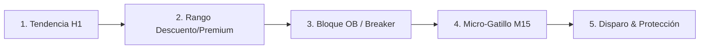

# 🦅 PLAN DE TRADING OFICIAL — AURUM CAPITAL
> **Estado de esta copia:** documento histórico. La configuración ejecutable vigente es **Aurum V15 en validación**, con 0.25% de riesgo por operación, 0.5% de riesgo inicial agregado, 1% de límite diario, cobertura de noticias obligatoria y entradas reales desactivadas por defecto. Las cifras de 868/893 operaciones no son una validación de rentabilidad: proceden de un export FIFO incompleto y deben conservarse como referencia, no como promesa.
**Versión:** 1.0 Institucional (SMC & Order Flow Edition)  
**Vigencia:** 2026 - 2027  
**Activos Validados:** USDJPYmicro, EURUSD, GOLDmicro  
**Plataformas:** MetaTrader 5 (AurumSniper / AurumSniperMicro) & TradingView (Aurum Vision)

---

## 🎯 1. Filosofía y Objetivos de Rendimiento

El objetivo primordial de este plan es **preservar el capital y explotar ventajas estadísticas asimétricas** (Riesgo:Beneficio $\ge$ 1:1.8) en las aperturas de mayor liquidez mundial (Londres y Nueva York).

* **Objetivo de Retorno Mensual:** **4% a 8% neto** con drawdown controlado.
* **Drawdown Máximo Permitido:**
  * **Diario:** **3.0%** (Cierre forzoso de operaciones y bloqueo del terminal).
  * **Total Cuenta:** **6.0%** (Pausa operativa y auditoría técnica obligatoria).
* **Riesgo Máximo por Operación:** **1.0%** de la equidad de la cuenta.
* **Límite de Operaciones:** **Máximo 3 trades al día.**

---

## 🧭 2. Selección y Clasificación de Activos

Basado en la auditoría estadística de 868 operaciones reales:

| Categoría | Activo / Símbolo | Temporalidad | Justificación Estadística |
| :--- | :--- | :---: | :--- |
| **TITULAR #1** | **`USDJPYmicro`** | **M15** | **72.7% Win Rate** en M15. Movimientos direccionales limpios y bajo spread. |
| **TITULAR #2** | **`EURUSD` / `EURUSDmicro`** | **M15 / H1** | **8.06 Profit Factor** y 70.6% WR. Mejor activo en sesión de Londres. |
| **TITULAR #3** | **`GOLDmicro`** | **M15** | **60.7% Win Rate** intradía durante el Overlap de Nueva York. |
| 🟡 **RESTRINGIDO** | **`GBPUSD`** | **H1 (Swing)** | Solo permitido en H1 en Londres con R:R > 1:2.5. Prohibido scalping M1/M5. |
| 🛑 **PROHIBIDO** | **`GBPUSDmicro` (Scalp)** | M1 / M5 | **13.5% WR global (0% en scalp)**. Destructor de capital por spreads y mechas. |
| 🛑 **PROHIBIDO** | **`BTCUSD`** | M1 / M5 | Cripto no respeta M5 los fines de semana (Profit Factor 0.31). Solo H4. |

---

## ⏰ 3. Horarios y Killzones Inviolables (Hora CDMX)

El 45.2% de las pérdidas históricas provinieron de operar en la sesión asiática y el rollover nocturno. Se implementa un **horario militar estricto**:

```
┌────────────────────────────────────────────────────────────────────────┐
│                        HORARIO OPERATIVO (CDMX)                         │
├────────────────────────────────────────────────────────────────────────┤
│ 01:15 AM - 05:30 AM  │ Sesión Londres      │ EURUSD, GBPUSD, USDJPY    │
│ 06:30 AM - 11:30 AM  │ Golden Overlap NY   │ GOLDmicro, EURUSD, US30   │
│ 11:30 AM - 01:15 AM  │ 🛑 ZONA PROHIBIDA   │ CERO ENTRADAS NUEVAS      │
└────────────────────────────────────────────────────────────────────────┘
```

* **A las 11:30 AM CDMX:** Se bloquean todas las nuevas entradas.
* **De 05:00 PM a 01:15 AM CDMX (Rollover y Asia):** Totalmente prohibido abrir trades (los spreads de XM se multiplican hasta por 5x).

---

## 🔬 4. Modelo de Entrada Sniper: Reglas SMC + Order Blocks

Cada operación debe cumplir con el **Filtro de 5 Pasos**:



1. **La Corriente (Tendencia Macro H1):**
   * **Compras:** Precio cotizando por encima de la EMA 200 de H1 y estructura Swing marcando `BOS Alcista`.
   * **Ventas:** Precio cotizando por debajo de la EMA 200 de H1 y estructura Swing marcando `BOS Bajista`.
2. **El Rango (Equilibrio 50%):**
   * Compras permitidas **únicamente en Zona de Descuento (< 50% del rango H1)**.
   * Ventas permitidas **únicamente en Zona Premium (> 50% del rango H1)**.
3. **El Punto de Reacción Institucional:**
   * El precio debe estar mitigando un **Order Block (OB)** activo o un **Breaker Block** (OB previo perforado que invirtió su polaridad).
   * Confluencia deseada: Presencia de un **Fair Value Gap (FVG)** o un **barrido previo de liquidez (EQH/EQL Sweep)**.
4. **El Gatillo de Confirmación (M15 / M5):**
   * Vela de rechazo o giro (pinbar con $\ge 30\%$ de mecha de absorción).
   * RSI rebotando de zonas de agotamiento (< 42 en compras, > 58 en ventas).
   * Confirmación de `CHoCH` en temporalidad menor.
5. **Colocación de Órdenes:**
   * **Stop Loss Mandatorio:** Colocado inmediatamente por detrás del Order Block / Breaker + Spread del broker.
   * **Prohibido terminantemente** ingresar órdenes a mercado sin Stop Loss inicial.

---

## 🛡️ 5. Gestión Monetaria y Salidas Escalonadas (Aurum Shield)

### Dimensionamiento de Posición (Lotaje Dinámico):
$$\text{Lote} = \frac{\text{Capital} \times 0.01}{\text{Distancia al SL en Puntos} \times \text{Valor por Punto}}$$
* En cuentas Micro, el riesgo por operación oscila entre **$1.00 y $3.00 USD**.

### Salidas en Fases (Gestión Activa del Trade):
* **Fase 1 (+1.0R a +1.3R):**
  * Cerrar el **50% del volumen**.
  * Mover el Stop Loss a **Break-Even (+1 pip)** para garantizar riesgo cero (*Free Trade*).
* **Fase 2 (+1.8R a +2.2R):**
  * Cerrar el **40% restante**. En Oro (`GOLDmicro`), se cierra el 100% de la posición.
* **Fase 3 (+3.0R - Runner):**
  * Solo aplicable en `EURUSD` y `USDJPYmicro`. Se activa Trailing Stop asegurando un mínimo de **+2.0R** asegurados.

---

## 🛑 6. Reglas de Conducta y Gestión Psicológica

1. **Regla de 2 Pérdidas (Anti-Revenge):**
   * Si 2 operaciones consecutivas resultan en pérdida en una misma sesión, **la jornada de trading se da por terminada automáticamente.** Se apaga el terminal MT5.
2. **Prohibido el "Martingala" y el Promedio a la Baja:**
   * Nunca se agrega volumen a una posición que se encuentra en números rojos.
3. **Estado del Bot en MT5:**
   * El botón de **"Algo Trading"** en la barra superior de MT5 debe permanecer **siempre encendido en verde**. Si se opera manual, el bot se encargará de gestionar el Break-Even y los parciales de forma automática.

---

## 📋 7. Checklist Pre-Vuelo para el Operador

Antes de hacer clic en Comprar o Vender, valida cada casilla:

- [ ] ¿Estamos dentro del horario permitido? (01:15 AM - 11:30 AM CDMX)
- [ ] ¿Llevo menos de 3 operaciones hoy?
- [ ] ¿El precio está a favor de la EMA 200 de H1?
- [ ] ¿El precio está en zona de Descuento (para compra) o Premium (para venta)?
- [ ] ¿El precio está rebotando en un Order Block o Breaker Block confirmado?
- [ ] ¿El Stop Loss está colocado y representa exactamente el 1.0% de mi capital?
- [ ] ¿El botón "Algo Trading" de MT5 está encendido?

*Si una sola casilla es negativa: **NO SE OPERA. Paciencia de francotirador.***

---

**Aurum Capital Algorithmic Trading Systems**  
*Aprobado para ejecución en cuentas reales e institucionales.*
