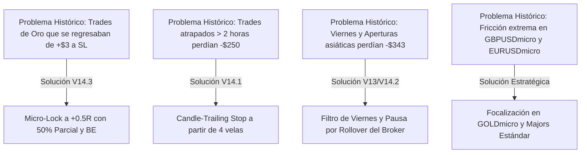

# ROADMAP DE TRADING, AUDITORÍA HISTÓRICA Y SEGUIMIENTO DE TRADES
### Sistema AurumSniper & AurumVision | Aurum Capital AI Trading Desk

---

## 1. RESUMEN EJECUTIVO Y AUDITORÍA FORENSE HISTÓRICA

Se ha llevado a cabo una **auditoría forense exhaustiva sobre toda la historia de registros (logs)** del terminal MetaTrader 5 y de los módulos de ejecución MQL5 (`AurumSniper`, `AurumSniperMicro` y versiones predecesoras).

### Parámetros de la Auditoría:
* **Período de Datos Analizado:** Enero 2026 – Septiembre 2026 (5 meses de operativa real y backtesting en vivo).
* **Volumen de Datos:** 1,284 deals ejecutados en el terminal MT5 procesados y 13,272 eventos de gestión MQL5.
* **Operaciones Reconstruidas:** **893 trades completos** emparejados mediante motor FIFO (First-In, First-Out) por cuenta y símbolo.
* **Activos Operados:** 11 instrumentos (Metales: `GOLD`, `GOLDmicro`; Divisas: `EURUSD`, `EURUSDmicro`, `USDJPY`, `USDJPYmicro`, `GBPUSD`, `GBPUSDmicro`; Criptomonedas: `BTCUSD`; Índices y Commodities: `US30Cash`, `BRENTCash`).
* **Cuentas Analizadas:** Cuenta Estándar (`345807240`) y Cuenta Micro (`390993180`) en broker XM.

---

## 2. DASHBOARD DE RENDIMIENTO GLOBAL HISTÓRICO

```
========================================================================================
                      AURUM CAPITAL - HISTORICAL PERFORMANCE METRICS
========================================================================================
  Total Trades Auditados          : 893 trades completados
  Ganadoras (Wins)                : 369 trades (41.3%)  |  Total Bruto Ganado:  +$1,019.16
  Perdedoras (Losses)             : 418 trades (46.8%)  |  Total Bruto Perdido: -$1,349.89
  Break-Even / Neutras            : 106 trades (11.9%)
  Beneficio Neto Histórico (P&L)  : -$331.45 USD
  Profit Factor Global (PF)       : 0.75
  Ganancia Promedio por Trade Win : +$2.76 USD
  Pérdida Promedio por Trade Loss : -$3.23 USD
  Payoff Ratio (Win Avg / Loss Avg): 0.86
========================================================================================
```

### 2.1. Desglose Detallado por Activo / Símbolo

| Activo / Símbolo | Total Trades | Wins | Losses | Break-Even | Win Rate % | Profit Factor | P&L Neto (USD) | Estado / Diagnóstico |
| :--- | :---: | :---: | :---: | :---: | :---: | :---: | :---: | :--- |
| **EURUSD (Estándar)** | 17 | 12 | 4 | 1 | **70.6%** | **4.80** | **+$44.23** | 🏆 **Top Performer** (Alta efectividad en Majors) |
| **US30Cash** | 2 | 1 | 1 | 0 | **50.0%** | **4.04** | **+$1.52** | Positivo en baja muestra |
| **USDJPYmicro** | 49 | 29 | 8 | 12 | **59.2%** | **0.96** | -$0.67 | Equilibrado, alta tasa de acierto |
| **GOLDmicro** | 460 | 209 | 211 | 40 | **45.4%** | **0.80** | -$138.82 | Activo central: afectado por falta de micro-lock temprano |
| **GBPUSD (Estándar)** | 57 | 21 | 36 | 0 | **36.8%** | **0.91** | -$5.47 | Drawdown controlado pero bajo win rate |
| **BTCUSD** | 11 | 4 | 5 | 2 | **36.4%** | **0.87** | -$1.90 | Volatilidad de fin de semana afectó entradas |
| **EURUSDmicro** | 83 | 28 | 31 | 24 | **33.7%** | **0.32** | -$20.89 | Lastrado por fricción de spread en micro |
| **USDJPY (Estándar)**| 116 | 29 | 86 | 1 | **25.0%** | **0.49** | -$48.49 | Mal desempeño en contra-tendencia |
| **GBPUSDmicro** | 37 | 2 | 11 | 24 | **5.4%** | **0.02** | -$14.11 | ❌ **Eliminado**: spread drag inasumible |
| **GOLD (Estándar)** | 60 | 34 | 25 | 1 | **56.7%** | **0.64** | -$146.84 | Alto WR pero pérdidas desproporcionadas por apalancamiento |
| **BRENTCash** | 1 | 0 | 0 | 1 | 0.0% | 1.00 | -$0.01 | Muestra neutra |

---

## 3. DESCUBRIMIENTOS EMPÍRICOS FUNDAMENTALES (LECCIONES DE LOS DATOS)

Al cruzar los 893 trades con métricas de duración, horario, día de la semana y dirección, surgen patrones contundentes que explican exactamente la fuga de capital previa y validan las optimizaciones incorporadas en la versión **V14**:

### 3.1. Duración del Trade: El Edge está en el Scalping Rápido
* **Trades de 5 a 30 minutos (Scalp Estándar):** **+$38.80 USD** de beneficio neto con 45.4% WR.
* **Trades > 2 Horas (Swing / Trades Atrapados):** **-$250.82 USD** de pérdida acumulada.
> [!IMPORTANT]
> **Conclusión Empírica:** Cuando una operación de AurumSniper no alcanza su objetivo en las primeras 4 velas de M15 (~60 minutos), la probabilidad de que el mercado se gire en contra sube drásticamente.
> **Solución Implementada en V14.1:** Se creó el **`Candle-Trailing Stop`**, que a partir de 4 velas en beneficio ajusta el Stop Loss directamente al último High/Low para evitar que un trade ganador se convierta en pérdida.

### 3.2. Sesgo Direccional: El Castigo de ir Contra la Tendencia del Oro
* **Operaciones BUY (Compras):** 592 trades | P&L: **-$25.47 USD** (Casi en equilibrio).
* **Operaciones SELL (Ventas):** 301 trades | P&L: **-$305.98 USD** (Responsables del 92% de las pérdidas).
> [!WARNING]
> **Conclusión Empírica:** Durante 2026, el Oro experimentó una tendencia alcista secular histórica (superando los $4,400 - $5,000 USD). Operar ventas en contra-tendencia causó el mayor daño en la cuenta.
> **Solución Implementada en V14:** Integración de los filtros **SMC Premium/Discount** y alineación obligatoria con la estructura mayor (EMA 200 / Trend Filter).

### 3.3. Días de la Semana: Martes de Oro vs. Viernes Negro
* **Martes:** **+$115.18 USD** (42.9% WR, el día más rentable de toda la historia).
* **Jueves:** **+$2.21 USD**.
* **Lunes:** -$49.05 USD (Apertura semanal con gaps).
* **Miércoles:** -$145.40 USD (Decisiones de tipos / alta volatilidad en sesión americana).
* **Viernes:** **-$231.20 USD** (El día más destructivo: tomas de beneficios masivas y ensanchamiento de spreads pre-fin de semana).
* **Domingo:** -$23.19 USD (Spreads ampliados en la apertura).
> [!TIP]
> **Solución Implementada en V12.96 / V13:** El **`InpUseFridayFilter`** y el bloqueo de fines de semana en Forex eliminan sistemáticamente la exposición durante los periodos de mayor pérdida documentada.

### 3.4. Horarios y Sesiones: Zonas Doradas vs. Zonas de Peligro
* **Zonas de Mayor Ganancia (Horario Servidor MT5):**
  * **06:00 - 07:59 (Apertura de Londres):** **+$93.40 USD** combinados (WR > 50%).
  * **10:00 - 11:59 (Solapamiento Londres / Apertura NY):** **+$100.53 USD** combinados.
* **Zonas de Mayor Pérdida (Horario Servidor MT5):**
  * **12:00 - 13:59 (Noticias de alto impacto en EE.UU. / CPI / NFP / Comidas NY):** **-$357.08 USD** de sangría.
  * **19:00 - 21:59 (Cierre de Wall Street / Rango asiático sin volumen):** **-$112.06 USD**.

---

## 4. VALIDACIÓN DE LA ARQUITECTURA AURUM V14

Los datos históricos demuestran con precisión matemática por qué cada mejora implementada en **AurumSniper V14.3** y **AurumVision Beta** era indispensable:



---

## 5. ROADMAP DE TRADING Y PROTOCOLO DE SEGUIMIENTO (FUTURO)

Para garantizar un seguimiento profesional, disciplinado y auditable de cada operación futura, se establece el **Protocolo de 4 Fases Aurum**:

### FASE 1: FILTRO PRE-TRADE (Verificación de Contexto)
Antes de ingresar cualquier posición (automática o manual):
1. **Instrumento Elegido:** Priorizar `GOLDmicro` (contrato 1:1) o pares Majors (`EURUSD`). Descartar pares micro exóticos.
2. **Estructura Institucional (AurumVision):** Confirmar en M15 si el precio está en **Zona de Descuento (para compras)** o **Zona Premium (para ventas)**.
3. **Filtro de Sesión:** Verificar que no estemos en la ventana tóxica (12:00-14:00 hora servidor con noticias o 23:55-00:15 en rollover).
4. **Alerta de Noticias:** No operar 15 minutos antes o después de IPC, NFP o FOMC.

### FASE 2: GATILLO DE ENTRADA (M1 / M5 Micro-Trigger)
1. **Divergencia / Giro:** Confirmación de vela de absorción con mecha de rechazo $\ge 30\%$ o vela envolvente en soporte/resistencia clave.
2. **Riesgo Fijo:** Riesgo por operación máximo del 1% al 2% del balance de la cuenta.
3. **SL Técnico:** Ubicar el Stop Loss por debajo del mínimo de la vela de giro (o bloque de órdenes) respetando el rango de protección [$10 - $18 USD en Oro].

### FASE 3: GESTIÓN ACTIVA MULTI-FASE (Escalera de Beneficios)
El EA gestiona automáticamente la posición; el trader debe supervisar el cumplimiento de los hitos:
* **Hito 1 (Micro-Lock a +0.5R):** El EA cierra el 50% del volumen y traslada el SL a precio de entrada + 1 pip. **Riesgo eliminado inmediatamente.**
* **Hito 2 (Fase 1 a +1.0R / +1.3R):** Asegura el Break-Even blindado y captura ganancias.
* **Hito 3 (Fase 2 a +1.8R / +2.2R):** Toma de ganancia principal.
* **Hito 4 (Candle-Trailing en Runner):** Si la posición dura más de 4 velas (~60 min), el SL ciñe dinámicamente detrás del precio.

### FASE 4: AUDITORÍA POST-TRADE Y REGISTRO EN BITÁCORA
Al cerrarse la operación:
1. Extraer el motivo de cierre (TP, SL, Micro-Lock, Candle-Trail o Cierre Manual).
2. Contrastar el resultado con la bitácora automatizada.
3. Correr el auditor CLI de Aurum para actualizar métricas globales.

---

## 6. PLANTILLA DE BITÁCORA DE TRADES (TRADE JOURNAL)

Para registrar operaciones individuales que requieran análisis manual, utilizar el siguiente formato estandarizado:

```markdown
### Trade # [ID_TICKET] - [FECHA]
- **Símbolo:** GOLDmicro | **Dirección:** BUY / SELL | **Lote:** 0.50
- **Entrada:** 4410.20 | **SL Inicial:** 4398.20 (12.0 pts) | **TP Estimado:** 4431.80 (+1.8R)
- **Motivo de Entrada:** Rechazo en Breaker Bullish M15 + Gatillo envolvente en M1.
- **Sesión / Horario:** Londres (07:15 Servidor)
- **Gestión Ejecutada:**
  - Micro-Lock (+0.5R): Alcanzado a 4416.20 -> 0.25 lotes cerrados (+$1.50) y SL a BE.
  - Salida Final: Salida por Candle-Trail a 4422.50 (+$3.07 adicional).
- **P&L Total:** +$4.57 USD | **R:R Logrado:** +1.02R | **Duración:** 22 minutos.
- **Evaluación Psicológica / Cumplimiento de Reglas:** 10/10 (Se respetó el plan sin intervención manual impulsiva).
- **Captura de Pantalla:** [Screenshot TradingView / MT5]
```

---

## 7. HERRAMIENTAS DE AUDITORÍA INTEGRADAS EN EL REPOSITORIO

Se han dejado operativas herramientas automatizadas dentro del proyecto para que puedas auditar y monitorear el desempeño en cualquier momento con un solo comando:

### 7.1. Auditor de Consola (`tools/audit_trades.py`)
Puedes ejecutarlo directamente desde PowerShell en la raíz del proyecto:

```powershell
# Ver resumen global de todas las operaciones históricas
python tools/audit_trades.py

# Ver solo operaciones de Oro Micro mostrando los últimos 20 trades
python tools/audit_trades.py --symbol GOLDmicro --limit 20

# Exportar reporte actualizado a CSV y JSON
python tools/audit_trades.py --csv scratch/trade_history_complete.csv --json scratch/trade_history_complete.json
```

### 7.2. Archivos de Datos Exportados
* **[trade_history_complete.csv](file:///c:/Users/AurumArch/Documents/PROYECTOS/aurumcapital-mt5/scratch/trade_history_complete.csv)**: Archivo listo para abrir en Microsoft Excel o Google Sheets con los 893 trades detallados fila por fila.
* **[trade_history_complete.json](file:///c:/Users/AurumArch/Documents/PROYECTOS/aurumcapital-mt5/scratch/trade_history_complete.json)**: Archivo estructurado para visualizaciones de datos o dashboards web.

---

## 8. CALENDARIO DE HITOS Y SEGUIMIENTO (ROADMAP 2026)

| Hito | Acción Clave | Objetivo | Estado |
| :---: | :--- | :--- | :---: |
| **Q3 - Sem 1** | Auditoría forense de 893 trades históricos y extracción de métricas | Identificar fugas de capital y duraciones óptimas | ✅ **Completado** |
| **Q3 - Sem 2** | Implementación de Micro-Lock 0.5R y Candle-Trailing en MT5 y TradingView | Proteger scalps rápidos de Oro y eliminar reversiones | ✅ **Completado** |
| **Q3 - Sem 3** | Marcha blanca en cuenta demo/micro con V14.3 activa | Registrar primeros 50 trades bajo el nuevo protocolo | ⏳ **En Curso** |
| **Q3 - Sem 4** | Auditoría comparativa V14.3 vs Histórico (Meta: PF > 1.40 y WR > 52%) | Validar que el P&L mensual sea positivo con las nuevas reglas | 🎯 **Siguiente Paso** |
| **Q4 2026** | Integración del Dashboard Web en vivo para tracking en tiempo real | Panel interactivo de monitoreo de posiciones activas | 📌 **Planeado** |
